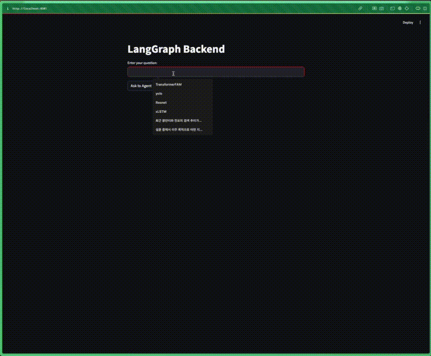
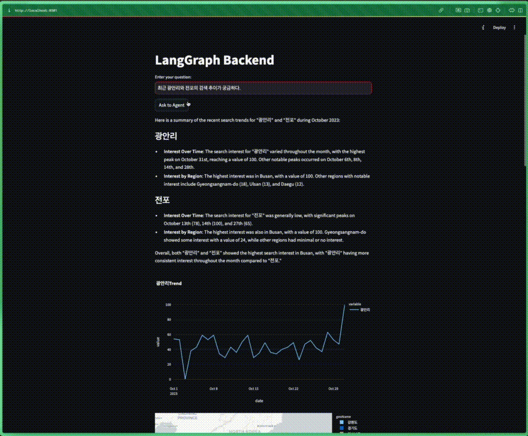
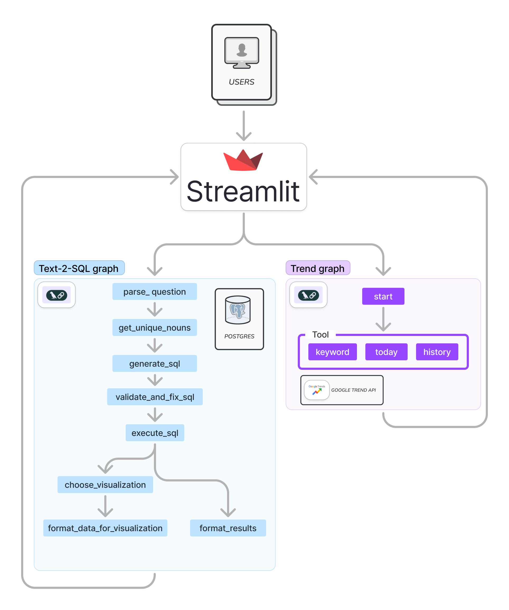

# DIVE2024 프로젝트

본 프로젝트는 LangGraph와 PostgreSQL을 활용한 데이터 분석 및 시각화 애플리케이션입니다. LangGraph 기반의 백엔드와 Streamlit 기반의 프론트엔드로 구성되어 있습니다.

> 주의:warning: 해당 프로젝트는 postgres DB를 docker 컨테이너를 사용하여 실행하고 있습니다. 따라서 해당 프로젝트를 실행하기 위해서는 docker가 설치되어 있어야 합니다.

## 예시 화면



## 프로젝트 구조


- `langgraph_back`: LangGraph 서버를 실행하기 위한 백엔드 코드
  - `dive_agent`: 데이터 분석 및 시각화 기능을 제공하는 에이전트
  - `trend_agent`: 트렌드 분석 기능을 제공하는 에이전트
- `langgraph_front`: Streamlit 앱으로 구현된 프론트엔드 코드
- `postgres_server`: 데이터 저장을 위한 PostgreSQL 데이터베이스 관련 코드
- `public`: 정적 파일들을 위한 디렉토리

## 환경 설정

1. 가상 환경 설정 (선택사항)
```bash
python -m venv .myenv
source .myenv/bin/activate  # Linux/Mac
# 또는
.myenv\Scripts\activate     # Windows
```

2. 필요 패키지 설치
```bash
pip install -r requirements.txt
pip install -r langgraph_back/requirements.txt
```

3. 환경 변수 설정
   - `langgraph_back` 디렉토리에 있는 `.env.example` 파일을 `.env`로 복사하고 필요한 API 키를 입력하세요:
   ```bash
   cp langgraph_back/.env.example langgraph_back/.env
   # 그 후 텍스트 에디터로 .env 파일을 열어 API 키 값을 수정합니다
   ```

## API 키 발급 방법

### OpenAI API 키 (필수)
1. [OpenAI API 웹사이트](https://platform.openai.com/signup)에 가입합니다.
2. 가입 후 로그인하고 우측 상단의 계정 메뉴에서 "View API keys"를 클릭합니다.
3. "Create new secret key" 버튼을 클릭하여 새로운 API 키를 생성합니다.
4. 생성된 키를 `.env` 파일의 `OPENAI_API_KEY` 값으로 설정합니다.

### SerpAPI 키 (검색 기능 사용 시 필요)
1. [SerpAPI 웹사이트](https://serpapi.com/users/sign_up)에 가입합니다.
2. 가입 후 대시보드에서 API 키를 확인합니다.
3. 해당 키를 `.env` 파일의 `SERPAPI_KEY` 값으로 설정합니다.

## 데이터베이스 설정

1. PostgreSQL 도커 컨테이너 실행
```bash
source postgres_server/build_docker.sh
```

2. 필요한 데이터 파일 준비
   - 데이터 파일(CSV)을 준비하여 `data/DB/` 디렉토리에 배치합니다
   - 디렉토리 구조는 다음과 같아야 합니다:
   ```
   data/
   └── DB/
       ├── lotte/
       │   ├── 002_ltmb_k7_data.csv
       │   └── 003_ltmb_mart_data.csv
       └── samsung/
           └── DIVE_FINAL_F.csv
   ```

3. 데이터베이스에 CSV 파일 업로드
```bash
python postgres_server/upload_csv.py
```

4. 데이터 업로드 확인
```bash
python postgres_server/upload_test.py
```

## 서버 실행

### 1. LangGraph 백엔드 서버 실행

백엔드 서버는 구동하고자 하는 에이전트에 따라 다르게 실행합니다. LangGraph 버전에 따라 실행 방법이 다를 수 있으니 참고하세요.

#### 데이터 분석용 서버 실행 (dive_agent)
```bash
# 현재 프로젝트의 LangGraph 서버 실행 방법은 추가 설정이 필요할 수 있습니다.
# 다음 명령어를 시도해보세요:
cd langgraph_back
python -c "from dive_agent.WorkflowManager import WorkflowManager; graph = WorkflowManager().returnGraph(); print('Graph loaded successfully')"
```

#### 트렌드 분석용 서버 실행 (trend_agent)
```bash
# 현재 프로젝트의 LangGraph 서버 실행 방법은 추가 설정이 필요할 수 있습니다.
# 다음 명령어를 시도해보세요:
cd langgraph_back
python -c "from trend_agent.WorkflowManager import WorkflowManager; graph = WorkflowManager().returnGraph(); print('Graph loaded successfully')"
```

### 2. Streamlit 프론트엔드 실행

실행한 백엔드 서버에 맞는 프론트엔드를 실행해야 합니다.

#### 데이터 분석용 프론트엔드 실행 (dive_agent 백엔드와 함께 사용)
```bash
source langgraph_front/start_streamlit.sh
```

#### 트렌드 분석용 프론트엔드 실행 (trend_agent 백엔드와 함께 사용)
```bash
source langgraph_front/start_trend_streamlit.sh
```

## 개발 환경

- Python 3.10+
- PostgreSQL
- Docker

## 참고사항

- 민감한 정보(.env 파일, API 키 등)는 절대 Git에 커밋하지 마세요.
- 대용량 데이터 파일은 `.gitignore`에 의해 Git에서 제외됩니다.
- 노트북 파일(.ipynb)은 주로 테스트 및 디버깅용으로만 사용됩니다.
- LangGraph 서버 실행 방법은 LangGraph 버전에 따라 다를 수 있으므로, 필요한 경우 LangGraph 문서를 참조하세요.